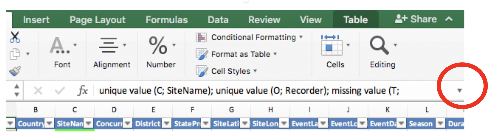
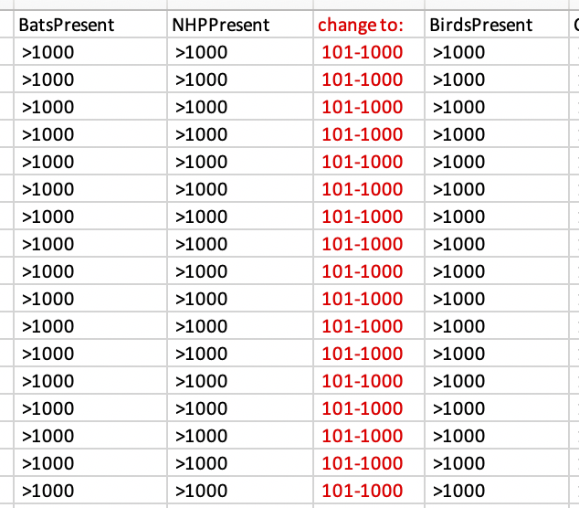

---
params:
  country: "Thailand"
title: 'EIDITH Data Cleaning Report: `r params$country`'
date: "`r Sys.Date()`"
output:
  html_document:
    keep_md: false
---

```{r setup, include = FALSE, message = FALSE, warning = FALSE}
knitr::opts_chunk$set(echo = FALSE, message = FALSE, warning = FALSE)
library(tidyverse)
library(lubridate)
library(openxlsx)
library(leaflet) 
library(knitr)
library(kableExtra)
library(stringi)
h <- here::here
walk(list.files(h("R/"), full.names = TRUE),
     source, echo = FALSE, verbose = FALSE)
country <- params$country
metadata <- eidith::ed2_metadata() %>% 
  filter(replacement_name!="DROP"| is.na(replacement_name)) 

```

{width="100%"}

#### _Click on the_ ▶ _︎arrows to expand sections._

<details>
<summary>Instructions - Read first!</summary>
**How to use these reports?**

Here are a few guidelines for using these reports to begin the data
cleaning process. These reports were compiled automatically and may help
identify data that are incorrect or require review. Please be aware data
must still be checked manually by a person familiar with the data who
can identify mistakes and make corrections.

For each table, you may check your data through two mechanisms: the
summary in the html report and the associated tab in the Excel file.

**Html report:**

*Site Locations*: All of the sites your team has sampled are marked on
the map, color coded by concurrent sites (mouseover points to see site
names and concurrent site names). All of the independent sites are gray.
This map should be used to confirm the correct placement of all site
locations. For example, if you see a blue point that is far away from
the other blue points, you will need to check whether the GPS points are
accurate or if the concurrent site is mislabeled.

*Site Names*: Check all individual site names to confirm the spellings
are correct.

*Summary Tables:*

-   *Field*: refers to each column in the EIDITH table. The following
columns are not summarized in these tables: latitude/longitude,
notes/comments, event name, and ID fields.

-   *Values*: a summary of values that were entered into EIDITH

    -   **Character fields** (e.g. Season) contain the unique text along with the number of times each value was given. Responses that occur only once are highlighted green. 

        -   Please confirm the **spelling** is correct and check **whether any fields should be combined** in fields that have free-text entry. For example. if you have the following animal-human interfaces: in house (1); IN HUMAN DWELLING (43); in human dwelling (108), you know that the correct interface is: “in human dwelling” (you can confirm that on the EIDITH data entry app), so the other interfaces need to be corrected. 
        
        -   Keep an eye out for **values that were only entered a few times**. For example, if you have the following for drinkingWaterShared: no (154); unknown (8); yes (2), you may want to confirm that there were two events/sites that truly have shared drinking water, or whether that was a mistake and all of them should be no/unknown.

    -   **Numeric and Date fields** (e.g. DurationDays) contain the entire range for all values in that column (e.g. 2-27).

        -   You are the best person to judge if that **range is reasonable** for your sites/animals. For example, if in your country/at your sites the only bats in the area are from two species of large fruit bats (say the typical arm length for both species is 140-160mm), and the range of the arm length on the html table is 21-160mm, then you should compare the EIDITH value of 21mm with your field data sheet to confirm the correct length that was measured.
        
    -    **“All empty”** is written if a column has no values entered.
    
            -   Please **confirm that it makes sense that you didn’t enter data for that column**. For example, if you never had a sick animal that you sampled, then it might make sense that the column for “ClinicalSignsOther” is all empty. Whereas a column like Country should never be all empty. 
            
-   *Count\_empty:* this is the number of rows that do not have a
value for that column. In general, you will want to double check the
columns that have empty values to confirm whether you need to make
corrections. Counts with zeros in the numerator indicate no empty
values.             

    -   For the majority of fields, the numerator is the total number of empty values for the given field and the denominator is the total number of rows in the table.  For certain fields, count_empty is adjusted to reflect the condition for which the field is relevant.  For example, NbrBeds is only required when DiseaseTransmissionInterfaces = "human hospital".  Therefore, the numerator is the number of times NbrBeds is empty when DiseaseTransmissionInterfaces = "human hospital", and the denominator is the number of times DiseaseTransmissionInterfaces = "human hospital". In other cases, where a field is entirely optional and no response is required, the count_empty is shown as "--". 

    -   Sometimes it makes sense that you have mostly empty data. For example:

        -   If it says 165/165, then the values column will corroborate that and say “all empty”.  If you only responded to one outbreak, count\_empty might be 160/165, which means that only 5 outbreak events were noted, which probably makes sense.
        
        -   In other cases, empty values point to an error. For example, if you have 2/165 empty from the Season column, you will need to make corrections for those 2 rows that are empty their Season.
        
**Excel file report:**

All of your data is listed in the Excel sheet (event, animal, specimens
etc are all separated by tabs). Please dig into these spreadsheets
beyond the checks below so you can get a good feel for the data and
**identify any issues that the automated check couldn’t find**. Also,
note that the automated check cannot determine whether a flag is
something that is correct or not, it can only indicate information that
you might want to double check.

There is a new column at the start of the
sheet called cleaning\_flags. This cell will have text in it and be
colored if the program identified something that needs to be checked in
that row. The text of the cleaning\_flags column will indicate what
issue needs to be checked and the column name (and column letter) that
needs to be checked in that row – be sure to check if the text is
wrapped by hitting the down arrow in the corner of the function bar (see
below) so you don’t miss any data to check.  
{width="4in"
height="1.3in"}

In addition to noting the issues in the cleaning\_flags column, cells
with values that need to be checked are colored:

-   Bright green means it is a unique value.

    -   On the event table, values are highlighted if they are unique within the *entire* table. On all other tables, values are highlighted if they are unique for the given *site name. *

    -   A unique value may be fine (e.g., an independent site that was only visited one time at the start of PREDICT 2), or it could indicate a mistake.

    -   While the system will pick up these misspellings, if you spell it wrong multiple times it won’t show up as an issue in the Excel file – though you should see it in the list of unique values on the html file.

-   Gray means no value was entered in that row (it is empty). 

    -  Please check to confirm whether you have data for that row to update EIDITH.  Note, for certain fields, the highlighting is applied only in cases where the field is relevant.  For example, empty values in CommunityEngagementDate are highlighted gray only when CommunityEngagement = "yes".

-   The whole row is light green:

    -   This means that there were notes given for this entry. **Always
    check all notes**, in case you noted that something was recorded
    incorrectly and needs to be changed.

-   Purple means there is a duplicate value for something that should be
unique (i.e., EventName, Animal\_ID, Specimen\_ID, ParticipantID)

-   Orange means that the event name does not match the site name and
date or that the specimen name does not match the indicated sample
type or medium (based on the original definitions at the launch of EIDITH). If you were collecting samples before the naming
became standardized, you will notice many issues.

    -   Please confirm with the field data that the specimen type and
    medium are correct in EIDITH.

    -   **DO NOT change specimen IDs to match the EIDITH format IF THE
    TUBE STILL HAS THE ORIGINAL ID!** In this case, we will leave
    the ID as it was given originally in order to be able to match
    the samples with the metadata. If you note that the ID entered
    into EIDITH is actually incorrect from what is written on the
    tube in your freezers, then you can change it.

-   Yellow means that the value is a numeric outlier, defined as greater
than the 75th percentile + 2.5 \* inter-quartile range (IQR) or less
than the 25th percentile - 2.5 \* IQR.

To facilitate the cleaning please make use of the filter buttons.  You can filter the cleaning\_flag column to remove the blanks and see all of the rows with values that need to be checked.  You can also filter each of the columns by color, so if you just want to see the unique values, you can filter by bright green

**Making and submitting corrections:**

*Please note:* Species, Q25 (other livelihoods) and Q29/31 (other symptoms) from the human questionnaire and the Illness module are being reviewed and cleaned by a global team.  Please do not submit changes for this data - contact technology@eidith.org to add/update season data as these are generated by EIDITH.

For all other data, if you need to make a correction, you can edit the provided Excel sheet
using the following steps. See the example image below.

1.  In Excel, insert a column to the right of the data that needs to be
changed and give it the heading "change to:". Change the heading
text to red.

2.  Leave the original data as it is and enter what you want the data
changed to in the newly inserted column. Highlight the new values in
red also.

3.  If updating data that contains multiple values, in the "change to:"
column enter the values as they should appear once the updates are
complete. For example, if the Insect Vectors column currently shows
"mosquito; tick" and you want to add sand fly, enter "mosquito; sand
fly; tick" in the newly inserted column.

4.  Do the same for every column of data that needs changing.

5.  Do NOT delete any columns in the extracts.

6.  Save the file it as an .xls file to retain the formatting.

7.  Send the file to <technology@eidith.org> and CC your country liason
and global surveillance lead. Indicate in the email which
sheets have changes.

{width="4.5in"
height="3.8in"}  

</details>

```{r read-data}

# all tables
table_names <- c("Event", "Animal",  "Specimen", "Test", "Human", "HumanAnimalProduction", "HumanCropProduction", "HumanExtractiveIndustry", "HumanHospitalWorker", "HumanHunter", "HumanMarket", "HumanRestaurant", "HumanSickPerson", "HumanTemporarySettlements", "HumanZoo", "AnimalProduction", "CropProduction", "Dwellings", "ExtractiveIndustry", "MarketValueChain", "NaturalAreas", "WildlifeRestaurant",  "ZooSanctuary")

# read in tables
tables <- map(table_names, function(x){

  # try reading in data
  out <- try(read_tsv(h("raw-eidith-data", paste0(x, "-", country, ".tsv.gz")),  col_types = get(paste(tolower(x), "specs", sep="_"))), silent=TRUE)

  # if data does not exist, make null object
  if(class(out)[1] == "try-error"){out <- NULL}

  return(out)
})

# give list names
names(tables) <- tolower(table_names)

# make an object for each table in list
for(i in seq_along(tables)){
  assign(names(tables[i]), tables[[i]])
}
```

```{r event-site-map}
# map site locations
leaflet(data = event) %>%
  addTiles() %>%
  addAwesomeMarkers(lng = ~SiteLongitude, lat = ~SiteLatitude,
                    label = get_event_labels(),
                    icon = get_event_icons()
  ) %>%
  addLegend(labels = get_event_legend()$label,
            colors = get_event_legend()$hex_color,
            opacity = 1)

```

<details>
<summary>Site Names</summary>
```{r site-names}
event %>%
  group_by(SiteName) %>%
  count() %>%
  ungroup() %>%
  mutate(SiteName = stri_join(SiteName, " (", n, ")")) %>%
  select(-n) %>%
  kable(format = "html", escape = FALSE) %>%
  kable_styling()

```
</details>

```{r summary-tables, results='asis'}

for (i in seq_along(tables)){

  tab <- tables[[i]]
  tab_name <- table_names[i]

  # check for empty cells
  metanames <- metadata %>%
    filter(endpoint2 == tab_name, original_name %in% names(tab)) %>%
    pull(original_name)
  if(tab_name == "Specimen"){metanames <- c(metanames, "TaxaGroup")} # include taxa group in specimen table for human samples despite being marked as DROP

  cat('\n')
  cat("<details>")
  cat(paste0("<summary>", tab_name,  " Summary</summary>") )
  create_unique_table(tab, module = tab_name, metanames, cols_to_ignore = c("Notes", "Comment", "SiteName", "ID", "EventName", "^Class$", "^Order$", "^Family$", "^Genus$", "Species", "Latitude", "Longitude"), do_not_count_empty = c("[Nn]otes", "[Cc]omment", "^Class$", "^Order$", "^Family$", "^Genus$", "Species", "OutbreakName", "InterfacesAnimalsSampled", "InterfacesHumansSampled", "CommunityEngagement", "TagAndOtherID", "[a-zA-Z]Width$", "[a-zA-Z]Height$", "[a-zA-Z]Length$", "^Container$", "StorageMethod", "StorageFacility", "StorageLocation", "LiveStateProv", "LiveLatitude", "LiveLongitude", "LivelihoodGroup\\(s\\)IfOther", "WorkLocation", "TravelledCity Loc [2-6]","Latitude Loc [2-6]", "Longitude Loc [2-6]", "Contact with", "[a-zA-Z]OutbreakDeaths", "Photos")) %>% print()
  cat("</details>")
  cat('\n')
}
```

```{r highlight-data}
# List event tables for specific highlighting rules 
event_tabs <- c("Event", "AnimalProduction", "CropProduction", "Dwellings", "ExtractiveIndustry", "MarketValueChain", "NaturalAreas", "WildlifeRestaurant", "ZooSanctuary") #

# Get highlights
markup <- map(seq_along(tables), function(i){

  tab <- tables[[i]]
  tab_name <- table_names[i]

  if(is.null(tab)){
    return()
  }

  # check for empty cells
  metanames <- metadata %>%
    filter(endpoint2 == tab_name, original_name %in% names(tab)) %>%
    pull(original_name)
  if(tab_name == "Specimen"){metanames <- c(metanames, "TaxaGroup")} # include taxa group in specimen table for human samples despite being marked as DROP

  empty_index <- get_empty(tab, module = tab_name, metanames, cols_to_ignore = c("[Nn]otes", "[Cc]omment", "^Class$", "^Order$", "^Family$", "^Genus$", "Species", "OutbreakName", "InterfacesAnimalsSampled", "InterfacesHumansSampled", "CommunityEngagement", "TagAndOtherID", "[a-zA-Z]Width$", "[a-zA-Z]Height$", "[a-zA-Z]Length$", "^Container$", "StorageMethod", "StorageFacility", "StorageLocation", "LiveStateProv", "LiveLatitude", "LiveLongitude", "LivelihoodGroup\\(s\\)IfOther", "WorkLocation", "TravelledCity Loc [2-6]","Latitude Loc [2-6]", "Longitude Loc [2-6]", "Contact with", "[a-zA-Z]OutbreakDeaths"))

  # check for solo unique chars (by site name unless Event table)
  solo_index <- get_solo_char(tab, by_SiteName = !tab_name %in% event_tabs)

  # check for numeric outliers (not including lat/long)
  outlier_index <- get_outlier(tab)

  # check that EventName matches SiteName and EventDate
  if(tab_name %in% event_tabs){
    event_index <- get_event_mismatch(tab)
  }else{ event_index <- NULL }

  # check that Speciman matches `Animal/Human ID` and SpecimenType and Media
  if(tab_name =="Specimen"){
    specimen_index <- get_specimen_mismatch(tab)
  }else{ specimen_index <- NULL }

  # check ID dups
  dup_fields <- c("EventName", "AnimalID", "SpecimenID", "Q1 ParticipantID", rep("ParticipantID", 10), rep("EventName", 8))
  dup_id_index <- get_dups(tab, dup_fields[i])

  bind_rows(empty_index,
            solo_index,
            outlier_index,
            event_index,
            specimen_index,
            dup_id_index)
})

names(markup) <- tolower(table_names)
```


```{r style-xlsx-table, include = FALSE}

# Get highlighted workbook object

markup_list <- compact(markup) #remove null

tables <- tables[names(markup_list)]

tables <- map(tables, ~mutate_if(.x, is.Date, as.character)) #date formatting before sending to excel

tables <- map(tables, ~mutate_if(.x, is.difftime, as.character)) #time formatting before sending to excel

wb <- get_highlighted_wb(
  dfs = tables,
  tab.names = names(tables),
  markup.dfs = markup_list
)

```

```{r write-xlsx-table, include = FALSE}
# Write the xlsx workbook for the country in question
saveWorkbook(
  wb,
  file = h("outputs", paste0(country, "-eidith-cleaning-workbook.xlsx")),
  overwrite = TRUE
)
```
